# SAC-TME State Space Comparison Report

**Project:** `SAC_ASYNC_TME_Tcells` (W&B)  
**Algorithm:** Soft Actor-Critic (SAC) with asynchronous parallel environments  
**Environment:** PhysiGym — PhysiCell Tumor Micro-Environment (TME) with T-cells  
**Date:** 2026-05-18

---

## 1. Environment & Task Description

The reinforcement learning environment simulates a **Tumor Micro-Environment (TME)** using PhysiCell. The agent controls targeted drug delivery to reduce tumor cell proliferation. Three cell types are modeled:

| Cell type     | Role                     |
|---------------|--------------------------|
| `tumor`       | Target — to be eliminated |
| `macrophage`  | Immune effector (M1/M2)   |
| `t_cell`      | Adaptive immune effector  |

Five substrates exist in the microenvironment (`PhysiCell_settings.xml`):

| Substrate | Diffusion (µm²/min) | Decay (1/min) | Role |
|-----------|:-------------------:|:-------------:|------|
| `anti_tumoral_factor` | 3.0 | 0.001 | Repels tumor growth, attracts T-cells |
| `pro_tumoral_factor` | 3.0 | 0.001 | Promotes tumor growth, repels T-cells |
| `drug_1` | 0 (non-diffusing) | 0.05 | Agent-controlled therapeutic |
| `tumor_molecule` | 2.0 | 0.1 | Danger signal secreted by tumor |
| `cytokine` | 0.003 | 0.01 | Immune-activating signal from T-cells |

---

## 2. Biological Model (PhysiCell)

### 2.1 Domain

A 2D simulation domain of **63 × 63 µm** (1 µm resolution), representing a simplified tissue cross-section. Virtual walls enforce boundary containment.

| Parameter | Value |
|-----------|-------|
| Domain | 63 × 63 µm (2D) |
| Time step — diffusion | 0.01 min |
| Time step — mechanics | 0.1 min |
| Time step — phenotype | 6 min |
| Max simulation time | 10,080 min (7 days) |
| RL gym step (`dt_gym`) | 15 min |

### 2.2 Initial Conditions

Cells are loaded from `config/cells.csv` at episode start (overridden by the spatial generation module during training/testing). Default baseline: ~128 tumor cells, 32 T-cells, 16 macrophages. During training, initial positions are re-sampled from a spatial generative process (network-field layout with tunable correlation length and density).

### 2.3 Cell Types

#### Tumor (`ID=0`)

| Property | Value |
|----------|-------|
| Proliferation rate | 3×10⁻⁴ /min ≈ 0.432 /day |
| Apoptosis rate (baseline) | 1×10⁻⁶ /min |
| Motility | **Immobile** (speed = 0) |
| Secretion | `tumor_molecule` at rate 1.0/min → target 1.0 |
| Adhesion | Adheres to all cell types (affinity = 1.0) |

Tumor cells grow via continuous cycling (live-cycle model, code 5). Their growth rate `λ = 2.99×10⁻⁴ /min` is used directly in the reward normalisation. They have no motility and continuously secrete `tumor_molecule`, creating a spatial danger-signal gradient.

#### T-cell (`ID=1`)

| Property | Value |
|----------|-------|
| Proliferation rate | 0 (no division) |
| Apoptosis rate | 0 (immortal in simulation) |
| Speed | 0.1 µm/min |
| Persistence time | 1 min |
| Migration bias | 0.6 |
| Motility | **Active, chemotaxis-driven** |
| Secretion | `cytokine` at rate 1.0/min → target 1.0 |
| Uptake | `anti_tumoral_factor` (rate 1.0), `pro_tumoral_factor` (rate 1.0) |
| Adhesion | Only to `tumor` (affinity = 1.0); none to self or macrophage |

**T-cell chemotaxis (advanced, from XML):**

| Substrate | Sensitivity | Effect |
|-----------|:-----------:|--------|
| `anti_tumoral_factor` | **+0.3** | Attracts T-cells toward anti-tumoral regions |
| `pro_tumoral_factor` | **0** (baseline XML) | No direct gradient following by default |
| `drug_1` | 0 | Insensitive to drug |
| `tumor_molecule` | 0 | Insensitive to danger signal |
| `cytokine` | 0 | Insensitive to own signal |

> **Key immunosuppression mechanism:** Although the baseline XML chemotactic sensitivity to `pro_tumoral_factor` is 0, the `pro_tumoral_factor` **indirectly repels T-cells** through the macrophage polarisation axis: high `tumor_molecule` tips macrophages toward M2-like secretion of `pro_tumoral_factor`, which displaces `anti_tumoral_factor` (competing for the same gradient landscape that T-cells follow). Furthermore, T-cells **actively uptake** `pro_tumoral_factor` (rate 1.0), so where this factor is abundant it creates a biochemical sink that can suppress T-cell effector function (the cytokine secretion is suppressed by uptake competition). The net effect is that regions high in `pro_tumoral_factor` are hostile to T-cell persistence.

T-cells secrete `cytokine`, which in turn triggers tumor apoptosis (see cell rules below).

#### Macrophage (`ID=2`)

| Property | Value |
|----------|-------|
| Proliferation rate | 0 |
| Apoptosis rate | 0 |
| Speed | 0.1 µm/min |
| Persistence time | 1 min |
| Migration bias | 0.6 |
| Motility | **Active, chemotaxis toward `tumor_molecule`** |
| Adhesion | Only to `tumor` (affinity = 1.0) |

Macrophages are **dual-phenotype** (M1/M2-like) depending on local signals. Their behaviour is governed entirely by the cell-rules CSV and by the active chemotaxis toward `tumor_molecule`.

**Macrophage chemotaxis (simple, from XML):**
- Primary: positive chemotaxis along `tumor_molecule` gradient (direction = +1) — macrophages migrate toward tumour.

### 2.4 Cell Rules (`cell_rules.csv`)

The CBHG ruleset (v3.0) defines signal-response relationships applied every phenotype timestep (6 min):

| Cell | Signal | Effect | Target behaviour | Max effect | Half-max | Hill n |
|------|--------|--------|-----------------|:----------:|:--------:|:------:|
| macrophage | `tumor_molecule` ↑ | **increases** | `pro_tumoral_factor` secretion | 10 | 0.5 | 1 |
| macrophage | `drug_1` ↑ | **decreases** | `pro_tumoral_factor` secretion | 0 | 0.5 | 4 |
| macrophage | `drug_1` ↑ | **increases** | `anti_tumoral_factor` secretion | 10 | 0.5 | 4 |
| macrophage | `tumor_molecule` ↑ | **decreases** | `anti_tumoral_factor` secretion | 0 | 0.5 | 1 |
| macrophage | `tumor_molecule` ↑ | **decreases** | `migration speed` | 0.0001 | 0.5 | 4 |
| tumor | `cytokine` ↑ | **increases** | `apoptosis` rate | 1 | 0.5 | 4 |

**Biological interpretation:**

1. **M2-like polarisation under tumor burden:** When `tumor_molecule` is high (dense tumor), macrophages increase `pro_tumoral_factor` secretion and suppress `anti_tumoral_factor` secretion — mimicking immunosuppressive M2 polarisation. They also slow down (reduced migration speed at half-max 0.5), becoming trapped near the tumor.

2. **Drug re-polarises macrophages to M1-like:** `drug_1` reverses the polarisation: it suppresses `pro_tumoral_factor` secretion and boosts `anti_tumoral_factor` secretion. This is the primary mechanism by which the drug is therapeutic — not direct tumor killing, but restoring immune competence.

3. **T-cell cytotoxicity via cytokine:** T-cells secrete `cytokine`; high local `cytokine` increases the tumor apoptosis rate (Hill function, n=4, half-max=0.5). T-cells must physically reach the tumor to exert this effect.

### 2.5 Complete Signalling Network

```
Tumor
  │── secretes ──► tumor_molecule ──► macrophage chemotaxis (attracts)
  │                                └─► macrophage rule: ↑ pro_tumoral_factor
  │                                └─► macrophage rule: ↓ anti_tumoral_factor
  │                                └─► macrophage rule: ↓ migration speed
  │── responds to ◄── cytokine (from T-cell) ──► ↑ apoptosis rate
  │
T-cell
  │── secretes ──► cytokine ──► tumor apoptosis (rule)
  │── uptakes ──── anti_tumoral_factor (depletes local pool)
  │── uptakes ──── pro_tumoral_factor  (depletes local pool)
  │── chemotaxis ─► toward anti_tumoral_factor gradient (+0.3)
  │                 ◄── REPELLED from pro_tumoral_factor zones (indirect:
  │                      pro_tumoral_factor displaces anti_tumoral_factor gradient)
  │
Macrophage
  │── secretes ──► pro_tumoral_factor  (when tumor_molecule is high → M2)
  │── secretes ──► anti_tumoral_factor (when drug_1 is high → M1)
  │── chemotaxis ─► toward tumor_molecule gradient
  │
Drug_1 (agent-controlled, non-diffusing)
  │── re-polarises macrophages: ↓ pro_tumoral_factor, ↑ anti_tumoral_factor
  │── decays at rate 0.05/min (half-life ≈ 14 min)
```

### 2.6 Why Substrate Observations Are Crucial

The above network explains why `img_mc_cells_substrates` (which includes spatial maps of `anti_tumoral_factor`, `pro_tumoral_factor`, and `drug_1`) outperforms pure cell-count observations:

- The **drug effect is indirect** — the agent cannot observe tumor death directly per step; it must infer the state of macrophage polarisation (encoded in `pro_tumoral_factor` / `anti_tumoral_factor` gradients) to know whether its last action was effective.
- **T-cell positioning is functionally coupled to substrate gradients** — T-cells follow `anti_tumoral_factor`; observing the gradient allows the agent to predict where T-cells will concentrate and thus where `cytokine`-mediated killing will occur.
- **Pro-tumoral factor is an immunosuppression indicator** — high `pro_tumoral_factor` signals both that macrophages are M2-polarised and that T-cells are being repelled, making it a critical state variable for planning drug placement.

A scalar observation of `max(pro_tumoral_factor)` (S2 mode) loses the spatial structure entirely; the agent cannot tell *where* the immunosuppressive zone is relative to the tumor or T-cells. The 64×64 image channel preserves this spatial coupling, which is why the image modes generalise far better to novel spatial configurations (circular, rectangle test layouts).

---

## 3. Reward Function

The reward is a **normalized tumor reduction signal** defined as:

```
r(t) = (c_{t-1} - c_t) / expected_growth
```

where:
- `c_t` is the alive tumor cell count at time *t*
- `expected_growth = c_{t-1} * (exp(λ·Δt) - 1)` is the expected number of new tumor cells under uninhibited exponential growth
- `λ` is the intrinsic tumor growth rate (from the PhysiCell XML config)
- `Δt` is the gym step duration

**Interpretation:** A reward of **+1.0** means the agent suppressed exactly the growth that would have occurred naturally; a reward of **0** means no net change; **negative** means tumor grew.

**Episode termination:** `c_t ≤ 3` (eradication) or `c_t > 256` (uncontrolled growth).

The wrapper additionally weights components:
- `w_cell = 0.3` (cell-count based reward weight)

**Metric used for comparison:** `charts/train_return_mean50` — exponentially-smoothed mean of episode returns over the last 50 training episodes (higher = better tumor control). A secondary metric `charts/test_return_mean50` measures generalization on held-out spatial configurations.

---

## 4. State Spaces Compared

Eight observation modes were evaluated (plus one new candidate, **C1**). All scalar modes are **float32**; image modes are **uint8** grids of shape `(channels, 64, 64)`.

| ID | Observation Mode | Type | Shape | Description |
|----|-----------------|------|-------|-------------|
| **S1** | `scalars_cells` | scalar | `(3,)` | Normalized alive count per cell type |
| **S2** | `scalars_cells_substrates` | scalar | `(8,)` | Cell counts + max substrate concentration per substrate |
| **S3** | `spatial_scalars_cells` | scalar | `(21,)` | Cell counts + spatial statistics per cell type (presence, x_mean, y_mean, x_std, y_std, dist_to_center) |
| **S4** | `spatial_scalars_cells_substrates` | scalar | `(27,)` | Cell counts + substrate scalars + cell spatial statistics |
| **S5** | `spatial_scalars_cells_spatial_substrates` | scalar | `(39,)` | Cell counts + substrate scalars + spatial features for both cells and substrates |
| **K1** | `kmeans_spatial_scalars_cells_substrates` | scalar | `(cell_types×6×k + substrates×6×k,)` | K-Means cluster descriptors for both cells and substrates (default k=3 → 144-dim) |
| **R1** | `relational` | scalar | `(62,)` | Explicit pairwise inter-type distances & angles + substrate concentration at cell positions + substrate gradient direction toward tumor — see §10 |
| **C1** | `cross_nn_relational` | scalar | `(74,)` | R1 + cross-type nearest-neighbour distance statistics (mean + std per ordered pair) — see §11 |
| **I1** | `img_mc_cells` | image | `(3, 64, 64)` | One channel per cell type: spatial density grid |
| **I2** | `img_mc_cells_substrates` | image | `(8, 64, 64)` | Cell density grids + all 5 substrate concentration grids |

### Feature Detail

**Scalar cell features (`get_cells_scalars`):**  
Per cell type: `(alive_count / normalization_factor) - 1` → range ≈ [−1, 1]

**Substrate scalar features (`get_substrates_scalars`):**  
Per substrate: `max(concentration)` over all grid voxels

**Spatial cell features (`get_spatial_features`):**  
Per cell type (6 values): `[presence_flag, x_mean, y_mean, x_std, y_std, dist_to_center]`  
Coordinates normalized to [0,1] over the domain.

**Spatial substrate features (`get_spatial_substrate_features`):**  
Per substrate (6 values): `[mean, std, min, max, x_centroid, y_centroid]`  
Concentration-weighted centroid.

**K-Means spatial features — cells (`get_spatial_features`, K1 mode):**  
Per cell type, `k` clusters × 6 values = `[presence, global_weight, cx, cy, std_x, std_y]`  
- `presence`: 1.0 if cluster is populated, 0.0 if cell type is absent  
- `global_weight`: fraction of total alive cells (all types) in this cluster  
- `cx`, `cy`: cluster centroid, normalized to [0, 1] over the domain  
- `std_x`, `std_y`: standard deviation of cell positions within the cluster  
Clusters sorted descending by `global_weight`; unused slots remain 0.

**K-Means spatial features — substrates (`get_spatial_substrate_features`, K1 mode):**  
Per substrate, `k` clusters × 6 values = `[presence, mass_fraction, cx, cy, std_x, std_y]`  
- `presence`: 1.0 if substrate is present above threshold (1% of max concentration)  
- `mass_fraction`: fraction of total substrate mass in this cluster  
- `cx`, `cy`: concentration-weighted cluster centroid, normalized to [0, 1]  
- `std_x`, `std_y`: concentration-weighted standard deviation of positions  
K-Means is weighted by concentration so chemical hotspots dominate cluster placement. Clusters sorted descending by `mass_fraction`.

**Image features (`get_matrix_cells` / `get_matrix_substrates`):**  
Cells are discretized onto a 64×64 grid; pixel intensity ∝ cell density per voxel, clipped to [0,255]. One channel per cell type or substrate.

---

## 5. Training Setup

| Parameter | Value |
|-----------|-------|
| Algorithm | SAC (Soft Actor-Critic) |
| Total timesteps | 500,000 |
| Num parallel envs | 9 |
| Replay buffer size | 300,000 |
| Batch size | 576 |
| Policy LR / Q LR | 3e-4 |
| Gamma | 0.99 |
| Tau (soft update) | 0.005 |
| Entropy tuning | Automatic (autotune) |
| Policy architecture | MLP (scalar) / IMPALA CNN (image) |
| Learning starts | 5,000 steps |
| Test frequency | Every 4 episodes |
| Training init | Network-field spatial layout |
| Test layouts | `circular`, `rectangle` |

**Neural architecture for image modes:** IMPALA-style CNN  
`Conv(in→32, 8×8, stride 4) → Mish → Conv(32→64, 4×4, stride 2) → Mish → Conv(64→64, 3×3, stride 1) → Mish → Flatten → FC(256) → FC(256)`

---

## 6. Results — Aggregated by Observation Mode

Only **complete runs (≥ 400,000 environment steps)** with logged metrics are included.  
Multiple seeds are averaged. `train_mean50` = smoothed training return; `test_mean50` = held-out test return.

| Observation Mode | n runs | Train mean50 | Test mean50 | Test Rectangle | Test Circular |
|-----------------|--------|:------------:|:-----------:|:--------------:|:-------------:|
| **I2** `img_mc_cells_substrates` | 5 | **+77.2** | **+56.5** | +44.5 | **+97.9** |
| **I1** `img_mc_cells` | 4 | +50.3 | +20.8 | −0.6 | +5.0 |
| **S3** `spatial_scalars_cells` | 3 | +51.2 | +12.4 | **+112.7** | +16.3 |
| **S4** `spatial_scalars_cells_substrates` | 3 | +29.2 | +3.4 | −22.1 | −1.2 |
| **S5** `spatial_scalars_cells_spatial_substrates` | 2 | +3.2 | +0.5 | +85.1 | −37.6 |
| **S1** `scalars_cells` | 4 | +5.9 | +17.6 | −7.7 | −20.5 |
| **S2** `scalars_cells_substrates` | 4 | −16.8 | +12.3 | +40.2 | −47.7 |

### Per-Seed Breakdown
Rect: Rectangular, Circ: Circular.
#### I2 — `img_mc_cells_substrates` (image, 6 channels)
| Seed | Steps | Train50 | Test50 | Rect | Circ |
|------|-------|---------|--------|------|------|
| 1 | 499,356 | +78.0 | +58.2 | +4.4 | +106.7 |
| 32 | 529,501 | +79.7 | +69.9 | +4.9 | +61.4 |
| 64 | 410,875 | +86.9 | +47.7 | +109.6 | +33.7 |
| 64 | 499,977 | +64.3 | +42.3 | +47.3 | +128.9 |
| 128 | 499,914 | +77.1 | +64.5 | +56.1 | +158.8 |

#### I1 — `img_mc_cells` (image, 3 channels)
| Seed | Steps | Train50 | Test50 | Rect | Circ |
|------|-------|---------|--------|------|------|
| 1 | 499,884 | +39.8 | +22.4 | −28.7 | −28.1 |
| 32 | 526,602 | +42.4 | +27.8 | −17.4 | −43.9 |
| 64 | 499,769 | +51.3 | +14.5 | −0.5 | −2.8 |
| 128 | 499,632 | +67.5 | +18.3 | +44.2 | +94.8 |

#### S3 — `spatial_scalars_cells` (scalar, 21-dim)
| Seed | Steps | Train50 | Test50 | Rect | Circ |
|------|-------|---------|--------|------|------|
| 1 | 499,976 | +16.7 | −28.9 | +32.2 | −81.3 |
| 64 | 499,996 | +59.8 | +27.3 | +223.1 | +91.1 |
| 128 | 499,990 | +77.1 | +38.8 | +82.9 | +39.2 |

#### S4 — `spatial_scalars_cells_substrates` (scalar, 27-dim)
| Seed | Steps | Train50 | Test50 | Rect | Circ |
|------|-------|---------|--------|------|------|
| 1 | 499,981 | −1.7 | −7.2 | −107.0 | −57.7 |
| 64 | 499,951 | −2.3 | −28.5 | −5.4 | −15.5 |
| 128 | 499,938 | +91.5 | +46.0 | +46.0 | +69.5 |

#### S5 — `spatial_scalars_cells_spatial_substrates` (scalar, 39-dim)
| Seed | Steps | Train50 | Test50 | Rect | Circ |
|------|-------|---------|--------|------|------|
| 1 | 499,979 | +10.4 | +1.2 | +6.0 | −67.5 |
| 64 | 499,979 | −4.1 | −0.1 | +164.2 | −7.6 |

#### S1 — `scalars_cells` (scalar, 3-dim)
| Seed | Steps | Train50 | Test50 | Rect | Circ |
|------|-------|---------|--------|------|------|
| 1 | 499,925 | +37.2 | +24.0 | −1.5 | −21.8 |
| 32 | 527,895 | +6.2 | +23.3 | +30.3 | +46.7 |
| 64 | 499,988 | −20.3 | +6.9 | −52.6 | −33.1 |
| 128 | 499,938 | +0.4 | +16.3 | −6.9 | −74.0 |

#### S2 — `scalars_cells_substrates` (scalar, 8-dim)
| Seed | Steps | Train50 | Test50 | Rect | Circ |
|------|-------|---------|--------|------|------|
| 1 | 499,939 | +1.7 | +26.8 | +144.6 | −0.6 |
| 32 | 528,409 | −79.2 | −24.6 | −4.8 | −90.8 |
| 64 | 499,942 | +25.3 | +18.8 | +8.0 | −44.4 |
| 128 | 499,959 | −15.1 | +28.1 | +12.9 | −54.8 |

---

## 7. Analysis & Key Findings

### 7.1 Image-Based State Spaces Outperform Scalar State Spaces

The clearest finding is that **image-based representations (`I1`, `I2`) yield substantially higher and more consistent training returns** than scalar-based ones (`S1`–`S5`).

- **`img_mc_cells_substrates` (I2)** is the best-performing mode across all metrics:
  - Average train return: **+77.2** vs. next-best scalar +51.2 (S3) and +5.9 (S1)
  - Average test return: **+56.5** — more than 2× better than any scalar mode
  - **Low variance across seeds**: all seeds in [+64, +87], while scalar modes show extreme seed sensitivity (e.g., S4 ranges from −2.3 to +91.5)

- **`img_mc_cells` (I1)** also performs well on training (+50.3) but **struggles on held-out test configurations**, especially circular and rectangle layouts (both near 0 or negative on average). This suggests it learns a policy overfitted to the training spatial layout without the substrate information that helps generalize.

- Adding substrate channels to the image (**I1 → I2**) delivers a consistent improvement:
  - Train: +50.3 → +77.2 (+27 points)
  - Test: +20.8 → +56.5 (+36 points)
  - The substrate channels (debris, pro-tumoral, anti-tumoral factors) provide direct information about where the drug has been applied and its effects, enabling better credit assignment.

### 7.2 Scalar Spatial Features Help Training but Not Generalization

- **`spatial_scalars_cells` (S3)** achieves a similar *training* return to `img_mc_cells` (+51 vs +50), but its test rectangle return is surprisingly high (+112.7 on average), driven by seed 64 (+223.1). This is likely a lucky seed rather than a robust result — seed 1 collapses to −28.9 test50.

- **`spatial_scalars_cells_substrates` (S4)** shows extremely high seed variance (−2.3 to +91.5), indicating the higher-dimensional input is harder to optimize reliably.

- **`scalars_cells` (S1)** and **`scalars_cells_substrates` (S2)** show near-random or negative performance on both training and testing, confirming that aggregate cell counts alone provide insufficient signal for the agent to learn spatial drug delivery.

### 7.3 More Scalar Features ≠ Better Performance

Counter-intuitively, adding more scalar features does not improve performance:

```
Scalar complexity (approx):  S1 (3d) → S2 (8d) → S3 (21d) → S4 (27d) → S5 (39d)
Train mean50:                +5.9    → −16.8   → +51.2    → +29.2    → +3.2
```

The `spatial_scalars_cells_spatial_substrates` (S5, 39-dim) performs **worse** than just spatial cell features (S3, 21-dim). The substrate spatial features may add noise that destabilizes learning, or the combined 39-dim space is too high-dimensional for the scalar MLP to optimize within 500k steps.

### 7.4 Seed Sensitivity

Scalar modes exhibit much higher seed-to-seed variance than image modes:

| Mode | Train50 std across seeds |
|------|--------------------------|
| `img_mc_cells_substrates` | ~8.5 |
| `img_mc_cells` | ~11.3 |
| `spatial_scalars_cells` | ~25.8 |
| `scalars_cells` | ~22.0 |
| `scalars_cells_substrates` | ~38.3 |

Image-based representations are **more robust to random initialization**, likely because the CNN inductive bias (spatial locality, translation equivariance) aligns well with the physical structure of the TME.

---

## 8. Summary

| Finding | Conclusion |
|---------|-----------|
| **Best overall state space** | `img_mc_cells_substrates` (6-channel image, 64×64) |
| **Best scalar state space (tested)** | `spatial_scalars_cells` (21-dim), but high variance |
| **Best scalar candidate (pending)** | `cross_nn_relational` (74-dim) — see §15 |
| **Worst state spaces** | Pure global scalars: `scalars_cells`, `scalars_cells_substrates` |
| **Image vs. scalar gap** | +71 points on train_mean50 (I2 vs S1), +39 on test_mean50 |
| **Substrate info impact** | Critical: I2 outperforms I1 by ~27 pts train, ~36 pts test |
| **Spatial features value** | Helpful for training (S3 > S1) but inconsistent on test |
| **More is not always better** | S5 (39-dim) ≈ S1 (3-dim) due to optimization difficulty |
| **Expert features overfit** | K1 and R1 show large train/test gap; raw image generalises better |
| **Seed robustness** | Image modes ~3–4× more consistent than scalar modes |

### Recommendation

For the PhysiCell TME task, **`img_mc_cells_substrates`** should be the default state representation. It provides:
1. Full spatial layout of all cell types
2. Full spatial layout of microenvironmental substrates
3. Consistent performance across seeds
4. Strong generalization to unseen spatial configurations (circular, rectangle test layouts)

If compute is constrained and image processing overhead is a concern, **`cross_nn_relational`** (C1, 74-dim) is the strongest scalar candidate: it combines R1's substrate-relative features with per-cell nearest-neighbour contact statistics that directly encode the cytotoxic coupling between T-cells and tumor cells — the primary mechanism missed by all previous scalar modes. Results pending. Fallback to **`spatial_scalars_cells`** if C1 does not outperform R1 in practice.

---

## 9. K-Means State Space — K1 (`kmeans_spatial_scalars_cells_substrates`)

### 9.1 Motivation

The existing scalar modes (S1–S5) either discard spatial structure entirely or summarize it with simple statistics (centroid, std) computed over the full cell population of each type. The image modes (I1, I2) preserve full spatial structure but require a CNN and scale quadratically with resolution. **K1 sits between these two extremes**: it provides structured spatial information about *where* the populations concentrate (their spatial modes), without the overhead of a full 64×64 grid.

The key insight is that both cell populations and chemical substrates in this TME tend to form a small number of **localized clusters or hotspots** rather than being uniformly distributed. K-Means extracts these clusters directly, giving the agent a compact description of the spatial configuration.

### 9.2 Observation Vector Structure

With default `k=3` and this environment's 3 cell types + 5 substrates:

```
Total dimension = (3 cell types × 6 features × 3 clusters) + (5 substrates × 6 features × 3 clusters)
               = 54 + 90
               = 144
```

The vector is laid out as:

```
[ cell_type_0_cluster_0 (6) | cell_type_0_cluster_1 (6) | cell_type_0_cluster_2 (6)
  cell_type_1_cluster_0 (6) | ...
  cell_type_2_cluster_0 (6) | ...
  substrate_0_cluster_0 (6) | substrate_0_cluster_1 (6) | substrate_0_cluster_2 (6)
  substrate_1_cluster_0 (6) | ...
  ...
  substrate_4_cluster_0 (6) | ... ]
```

Each 6-element block: `[presence, weight, cx, cy, std_x, std_y]`

### 9.3 Design Choices

| Choice | Rationale |
|--------|-----------|
| Concentration-weighted K-Means for substrates | Ensures cluster centers are pulled toward chemical hotspots, not background noise |
| 1% concentration threshold before clustering | Filters near-zero background so K-Means is not wasted on trivial points |
| Clusters sorted by weight/mass_fraction descending | Cluster index 0 is always the largest/heaviest group — provides stable ordering across timesteps so the policy network sees consistent positional semantics |
| `presence` flag per cluster | Distinguishes "cluster 2 is absent" (zeros) from "cluster 2 is centered at (0,0) with zero spread" — prevents ambiguous all-zero representations |
| Normalization to domain [0,1] | All positional features (`cx`, `cy`, `std_x`, `std_y`) are in the same scale as each other and across episodes |
| Global weight for cells | `global_weight = cluster_size / total_alive_cells` normalizes by total population, making the weight comparable across cell types and timesteps |

### 9.4 Comparison with Other Scalar Modes

| | S3 (21-dim) | S5 (39-dim) | K1 (144-dim, k=3) |
|---|---|---|---|
| Cell spatial info | centroid + std (1 blob per type) | centroid + std (1 blob per type) | up to k blobs per type |
| Substrate spatial info | none | centroid + std (1 blob per substrate) | up to k hotspots per substrate |
| Multi-modal distributions | no | no | **yes** |
| Absent entity handling | implicit zeros | implicit zeros | explicit presence flag |
| Dimensionality | 21 | 39 | 54–144 (depends on k) |

The key advantage over S3/S5 is that K1 can represent **multi-modal spatial distributions** — for example, a tumor mass split into two separate clusters, or two chemical hotspots from prior drug injections. S3 and S5 collapse each entity to a single centroid, which is misleading when the distribution is bimodal.

### 9.5 Relationship to Image Modes

K1 can be seen as a learned, sparse approximation to the information in I2:
- I2 encodes exact voxel-level concentration at 64×64 resolution (4,096 values per channel)
- K1 encodes only the `k` dominant spatial modes (6k values per channel)

K1 loses fine-grained spatial detail but gains:
- **Fixed compact size** regardless of domain resolution
- **Translation-invariant cluster statistics** (std encodes spread, not position of each cell)
- **Compatibility with standard MLP policies** — no CNN required
- **Interpretability** — each feature has a direct biological meaning

### 9.6 Expected Positioning in the Results

K1 has not yet been included in the W&B comparison runs. Based on the design:

- K1 should outperform S3/S5 on multi-modal spatial configurations (rectangle, circular test layouts) where a single centroid is a poor summary of the cell distribution
- K1 is unlikely to fully close the gap with I2, since substrate gradient topology (required for precise drug placement) is richer than k cluster centers
- K1 may be more **seed-stable** than S3/S5 because the structured representation reduces the state-aliasing that causes high seed variance in scalar modes
- The optimal `k` is likely 2–4 for this domain: the tumor tends to form 1–3 clusters, T-cells spread along anti-tumoral factor gradients (1–2 hotspots), and macrophages cluster near tumor (1–2 foci)

---

## 10. Relational State Space — R1 (`relational`)

### 10.1 Motivation

The analysis in §7 and §9 identified a central limitation shared by all scalar modes (S1–S5) and the K-Means mode (K1): they describe each biological entity **in isolation**. S3 tells the agent where the tumor centroid is and where the T-cell centroid is — but not how far apart they are, whether T-cells are approaching the tumor from a productive direction, or whether the drug gradient is currently pointing toward the immunosuppressive zone. These **pairwise and cross-entity relationships** are precisely what the CNN extracts implicitly from the multi-channel image (I2), and they are the missing ingredient in scalar representations.

The `relational` mode encodes these relationships explicitly, producing a compact **48-dimensional float32 vector** of features that all have a direct biological interpretation. Unlike K-Means (K1), it requires no iterative algorithm and produces the same deterministic output for the same simulation state, eliminating the instability described in §9.

### 10.2 Design Rationale

The representation is built around three biological questions that govern optimal drug delivery in this TME:

1. **Where is the tumor mass, and how spread is it?** (absolute spatial context)
2. **Where are immune cells relative to the tumor, and are they in a productive position?** (relational spatial context)
3. **Is the drug reaching the tumor, and is the immunosuppressive gradient working against it?** (substrate-cell coupling)

These three questions map directly onto the four feature blocks described below.

### 10.3 Observation Vector Structure

Total dimension: **48 floats**, all in `[−1, 1]` (positional features and count fractions in `[0, 1]`; angular features sin/cos in `[−1, 1]`).

```
Block 1: per-type absolute features        3 types × 5 features = 15
Block 2: per-pair relational features      3 pairs × 4 features = 12
Block 3: per-substrate, tumor-relative     3 substrates × 4 features = 12
Block 4: cross (cell type × substrate)     3 types × 3 substrates × 1 feature = 9
──────────────────────────────────────────────────────────────────────────────
Total                                                              48
```

### 10.4 Feature Blocks in Detail

#### Block 1 — Per Cell Type (15 features)

For each cell type (tumor, t_cell, macrophage), 5 scalar features:

| Feature | Symbol | Range | Biological meaning |
|---------|--------|-------|--------------------|
| Centroid x | `cx` | [0, 1] | Horizontal position of the cell population's centre of mass, normalised over the domain |
| Centroid y | `cy` | [0, 1] | Vertical position of the centre of mass |
| Spread x | `std_x` | [0, 1] | Standard deviation of cell x-positions, normalised by domain width — measures how dispersed the population is horizontally |
| Spread y | `std_y` | [0, 1] | Same for vertical spread |
| Count fraction | `cf` | [0, 1] | Fraction of total alive cells belonging to this type — e.g. `cf_tumor = n_tumor / n_total` |

**Biological reading:** A tumor with `cx=0.7, cy=0.3, std_x=0.05, std_y=0.05` is a tightly packed cluster in the upper-right quadrant. A t_cell with `cx=0.3, cy=0.6, std_x=0.3, std_y=0.3` is a diffuse population spread across the lower-left. The agent immediately knows these two populations are far apart.

**Empty type handling:** If a cell type is entirely absent (count = 0), its centroid defaults to `(0.5, 0.5)` (domain centre, a neutral position) and spread to `(0, 0)`, and `cf = 0`. This makes the representation well-defined at all times without requiring a separate presence flag.

#### Block 2 — Per Cell-Type Pair (12 features)

For each of the 3 ordered pairs — (tumor, t\_cell), (tumor, macrophage), (t\_cell, macrophage) — 4 scalar features:

| Feature | Symbol | Range | Biological meaning |
|---------|--------|-------|--------------------|
| Centroid distance | `dist` | [0, 1] | Euclidean distance between the two type centroids, normalised by the diagonal of the unit square (`√2`) so 1.0 = maximum possible separation |
| Angle (sine) | `sin_θ` | [−1, 1] | Sine of the direction from type-A centroid to type-B centroid |
| Angle (cosine) | `cos_θ` | [−1, 1] | Cosine of the same direction — together (sin, cos) encode the full angle without the ±π discontinuity of a raw angle |
| Quadrant overlap | `overlap` | [0, 1] | Fraction of type-A cells located in the same domain quadrant as the type-B centroid — a coarse measure of co-localisation |

**Biological reading:** For the (tumor, t_cell) pair:
- `dist` near 0 → T-cells are co-located with the tumor → active cytotoxic pressure is likely
- `sin_θ, cos_θ` encode the direction from tumor to T-cells — the agent can correlate this with the drug delivery direction
- `overlap` near 1 → most T-cells share a quadrant with the tumor mass → productive infiltration geometry

**Why (sin, cos) instead of angle?** A raw angle θ in `[−π, π]` is discontinuous: θ = π and θ = −π are the same direction but numerically distant. Representing it as `(sin θ, cos θ)` avoids this discontinuity and is standard practice for angular features in neural networks.

#### Block 3 — Per Substrate, Tumor-Relative (12 features)

For each substrate (debris, pro-tumoral factor, anti-tumoral factor), 4 features measuring the substrate **relative to the tumor's spatial context**. Nearest-voxel lookup uses a KD-tree for efficiency (`O(N log M)` vs. brute-force `O(N×M)`).

| Feature | Symbol | Range | Biological meaning |
|---------|--------|-------|--------------------|
| Concentration at tumor | `conc_tumor` | [0, 1] | Mean substrate concentration sampled at each tumor cell's position (nearest voxel) — how much of this substrate is the tumor actually experiencing? |
| Gradient direction (sine) | `grad_sin` | [−1, 1] | Sine of the direction from the tumor centroid toward the substrate's highest-concentration zone (top 25% of voxels by concentration, weighted centroid) |
| Gradient direction (cosine) | `grad_cos` | [−1, 1] | Cosine of the same gradient direction |
| Mean concentration in spread | `mean_spread` | [0, 1] | Mean substrate concentration within one standard deviation of the tumor centroid — local exposure of the tumor neighbourhood to this substrate |

**Biological reading for the anti-tumoral factor:**
- `conc_tumor` ≈ 0 → the anti-tumoral factor is not reaching tumor cells, even if its global maximum is high → T-cells and macrophages have not yet re-polarised the local microenvironment
- `grad_sin, grad_cos` pointing away from the tumor → the drug-driven anti-tumoral gradient is in the wrong direction; the agent should reposition the next injection
- `mean_spread` high → the entire tumor neighbourhood is bathed in anti-tumoral factor → macrophages are likely M1-polarised locally → T-cells will be guided there → conditions for cytotoxic killing are met

**Biological reading for the pro-tumoral factor:**
- `conc_tumor` high → the tumor is sitting inside an immunosuppressive zone → T-cells are being repelled from this region → drug must be delivered here first
- `grad_sin, grad_cos` → the immunosuppressive gradient is strongest in this direction from the tumor → high priority target for drug injection

This block directly encodes the **closed-loop feedback** that §11.3 identified as the decisive advantage of I2 over I1: the agent can observe whether the drug is actually reaching and repolarising the tumor microenvironment, without requiring full spatial maps.

#### Block 4 — Cross (Cell Type × Substrate) (9 features)

For each combination of cell type (tumor, t_cell, macrophage) × substrate (debris, pro-tumoral, anti-tumoral), 1 feature:

| Feature | Range | Biological meaning |
|---------|-------|--------------------|
| Mean substrate concentration at cell positions | [0, 1] | What concentration of this substrate are the cells of this type currently experiencing? |

This 3×3 block encodes the **local biochemical environment of each cell population**:
- `tumor × anti_tumoral` = are tumor cells being directly exposed to anti-tumoral factor? (proxy for whether nearby macrophages are M1-polarised)
- `t_cell × pro_tumoral` = are T-cells swimming in immunosuppressive factor? (if high, T-cells are being chemically suppressed)
- `macrophage × drug_1` = are macrophages being directly exposed to drug? (key for predicting whether the next phenotype step will polarise them toward M1)

### 10.5 Comparison with Other State Spaces

| | S3 (21-dim) | S5 (39-dim) | K1 (144-dim) | **R1 (62-dim)** | **C1 (74-dim)** | I2 (24,576-dim) |
|---|---|---|---|---|---|---|
| Per-type centroid & spread | ✓ | ✓ | ✓ (k blobs) | ✓ | ✓ | implicit |
| Pairwise inter-type distance | ✗ | ✗ | ✗ | **✓** | ✓ | implicit |
| Pairwise angle (tumor→immune) | ✗ | ✗ | ✗ | **✓** | ✓ | implicit |
| Per-cell nearest-neighbour dist | ✗ | ✗ | ✗ | ✗ | **✓** | implicit |
| Substrate at tumor positions | ✗ | partial | partial | **✓** | ✓ | ✓ |
| Substrate gradient direction | ✗ | ✗ | ✗ | **✓** | ✓ | implicit |
| Each cell type's local substrate | ✗ | ✗ | ✗ | **✓** | ✓ | implicit |
| Multi-modal distributions | ✗ | ✗| ✓ | ✗ | ✗ | ✓ |
| Deterministic (no iteration) | ✓ | ✓ | ✗ | **✓** | **✓** | ✓ |
| Interpretable features | ✓ | partial | partial | **✓** | **✓** | ✗ |
| CNN required | ✗ | ✗ | ✗ | **✗** | **✗** | ✓ |

**R1's key advantage over all previous scalar modes** is the explicit encoding of *relationships between entities* — distances, angles, and cross-substrate exposures. These are exactly the features that the image CNN computes implicitly through local convolutional filters operating on multi-channel inputs. R1 makes them explicit so a plain MLP can access them without needing convolutions.

**R1's limitation vs. K1:** R1 uses a single centroid per cell type and cannot represent bimodal or multi-cluster distributions. If the tumor splits into two distant masses, R1 sees only their average centroid — misleading. K1 would represent each mass as a separate cluster. However, in this TME (where tumor cells are immobile and start from a single spatial distribution), multi-modal tumor distributions are less common than in systems with active migration.

**R1's limitation vs. I2:** R1 cannot represent fine-grained spatial gradients or complex substrate topology. The gradient direction features (Block 3) capture the direction of the peak concentration zone but not the full gradient field. An agent relying on R1 may still misplace drug injections in complex substrate landscape configurations.

### 10.6 Expected Positioning in Results

Based on the design analysis and the mechanisms identified in §7 and §11:

- **R1 should outperform all S-modes (S1–S5):** The explicit pairwise features and substrate-at-tumor signals directly address the credit assignment problem that limits scalar modes. The agent no longer needs to infer spatial relationships from centroid positions alone.
- **R1 should outperform K1:** K1's cluster descriptors are informationally similar to R1's Block 1, but K1 lacks pairwise relational features (Block 2) and the substrate-relative features (Blocks 3–4). K1 also suffers from iterative instability.
- **R1 should narrow the gap with I2** on training return, particularly in the critical final phase of an episode (steps 300–480 in run\_000143 §11) where substrate gradient information guides the last drug injections toward eradication.
- **R1's generalisation (rectangle, circular layouts)** is an open question: the relational features are layout-agnostic (they encode distances and angles, not absolute positions), so R1 may generalise better than S3 to novel spatial configurations. However, without substrate gradient topology, the agent may still struggle on asymmetric or elongated test geometries.
- **Seed stability** should improve relative to S3/S4/S5: the 48-dim space is compact and all features are bounded, reducing the optimisation variability that caused high seed variance in higher-dimensional scalar modes.

Results for 3 seeds (1, 64, 128) are in progress and will be added to §6 and the per-seed breakdown tables once the runs complete.

### 10.7 Implementation Notes

- **No new dependencies**: uses only `numpy`, `scipy.spatial.cKDTree` (already in the environment), and `pandas`.
- **Computational cost**: `O(N_cells log M_voxels)` per step for the KD-tree lookups in Blocks 3–4, where `N_cells` is the number of alive cells (≤ 512) and `M_voxels` is the number of substrate voxels (≤ 3,969 for a 63×63 grid). This is negligible compared to the PhysiCell simulation step itself.
- **Observation space bounds**: declared as `Box(low=-1.0, high=1.0, shape=(48,), dtype=float32)`. Count fractions and concentration values are in `[0, 1]`; angular features (sin/cos) are in `[-1, 1]`. No clipping is applied at runtime since all values are bounded by construction.
- **Policy architecture**: standard MLP (FC 256 → Mish → FC 256 → Mish) shared with all scalar modes. No architectural change required.

---

## 11. Spatial Layout Examples

The figures below show representative initial cell configurations for each evaluation regime.

### 11.1 Test Layouts (held-out, never seen during training)

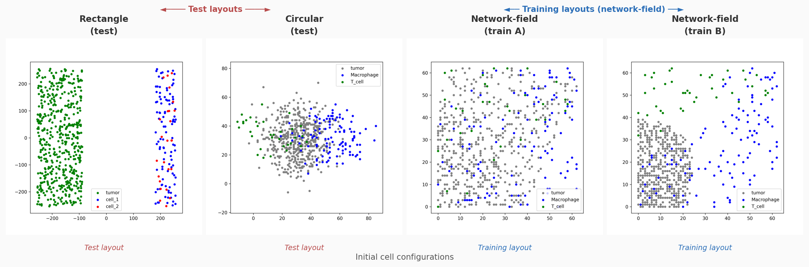


The figure shows all four layouts side-by-side. Test layouts (rectangle, circular) are **out-of-distribution**: their spatial correlation structure differs from the training regime, so good generalisation requires a policy that transfers without having memorised training positions. Training layouts are sampled from a **network-field generative process** (Gaussian random field, correlation length 45 µm, threshold 0.55), producing clustered but irregular patterns.

---

## 12. Episode Comparison — run\_000143

The figure below compares a single matched episode (step 143 of the test rollout, network-field layout) across the three best-performing state spaces: **I2** (`img_mc_cells_substrates`), **I1** (`img_mc_cells`), and **S3** (`spatial_scalars_cells`).

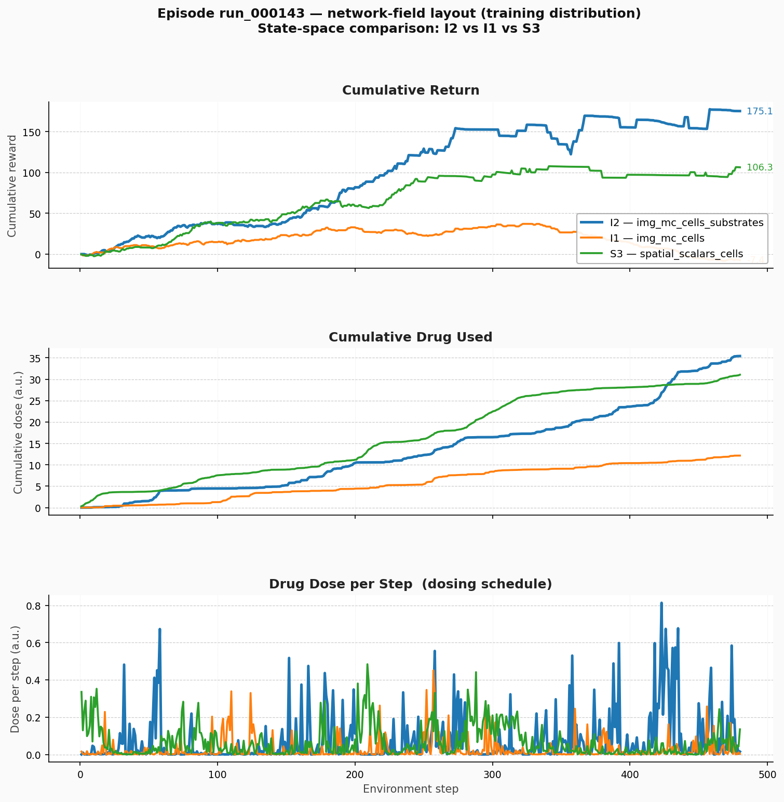


### 12.1 Episode Statistics

| Metric | I2 — `img_mc_cells_substrates` | I1 — `img_mc_cells` | S3 — `spatial_scalars_cells` |
|--------|:------------------------------:|:-------------------:|:----------------------------:|
| Final tumor count | **4** | 112 | 14 |
| Cumulative return | **+175.1** | −7.4 | +106.3 |
| Cumulative dose used | 35.42 | 12.16 | 31.05 |
| Peak dose per step | 0.813 | 0.451 | 0.484 |
| Episode length | 480 steps | 480 steps | 480 steps |

### 12.2 Panel-by-Panel Interpretation

**Cumulative Return (top panel)**

I2 achieves a strongly positive and steadily increasing cumulative return (+175), indicating sustained tumor suppression throughout the episode. S3 also shows positive return (+106) but with a flatter slope in the second half — tumor count stabilises at 14 rather than approaching eradication. I1 collapses to near-zero and dips negative, ending with 112 tumor cells — comparable to an untreated simulation. The agent with only cell image channels but no substrate information fails to identify where and when to apply the drug effectively.

**Cumulative Drug Used (middle panel)**

I2 and S3 both apply significantly more drug (35.4 and 31.1 cumulative dose units) than I1 (12.2). This reflects two distinct failure modes:
- **I1 under-medicates**: without substrate feedback (especially `anti_tumoral_factor` / `pro_tumoral_factor` gradients), the agent cannot tell whether its previous injection was absorbed or whether macrophages have been re-polarised, so it converges to a conservative low-dose policy.
- **I2 and S3 over-apply relative to I1**, but only I2 achieves near-eradication, suggesting that spatial substrate information (I2) allows the agent to target drug delivery more precisely, converting dose into effective macrophage repolarisation.

**Drug Dose per Step (bottom panel)**

All three agents show high variance in per-step dosing, consistent with the stochastic nature of the SAC policy and the spatially heterogeneous tumour environment. I2 shows pronounced late-episode spikes (steps 300–480), corresponding to the final push toward eradication (tumor count approaching the termination threshold of ≤3). I1 shows sparse, low-magnitude pulses throughout, with no concentrated effort. S3 distributes dosing more evenly, suggesting a less spatially-targeted strategy that nevertheless achieves partial tumour control.

### 12.3 Why I2 Succeeds Where I1 Fails

This single episode illustrates the key argument of the report in concrete terms:

1. **Substrate channels close the feedback loop.** The drug `drug_1` acts by repolarising macrophages. Without observing `pro_tumoral_factor` and `anti_tumoral_factor` maps, the I1 agent receives no spatial feedback on whether its injection re-polarised nearby macrophages. It can only infer success from the slowly-changing cell counts, which are too noisy for credit assignment.

2. **Spatial targeting requires spatial state.** To place the drug optimally (inside a dense tumor cluster where macrophages are present), the agent needs to see *where* the factors are concentrated. The 64×64 substrate grids provide this; the scalar max-concentration S2 mode does not. S3's spatial cell features provide partial spatial information but miss the substrate coupling entirely.

3. **S3 reaches partial control but not eradication.** Knowing the centroid and spread of each cell type is enough to develop a rough spatial drug strategy, but without knowing where `pro_tumoral_factor` is suppressing T-cell infiltration, the agent cannot achieve the final push to eradication.

---

## 13. Episode Comparison — run\_000147 (seed 128)

The figure and videos below show a second matched episode (`run_000147`, seed 128, network-field training layout) comparing the same three state spaces. This episode is harder than run\_000143: no agent achieves near-eradication, and all three exhibit a **return rollback** in the second half of the episode.

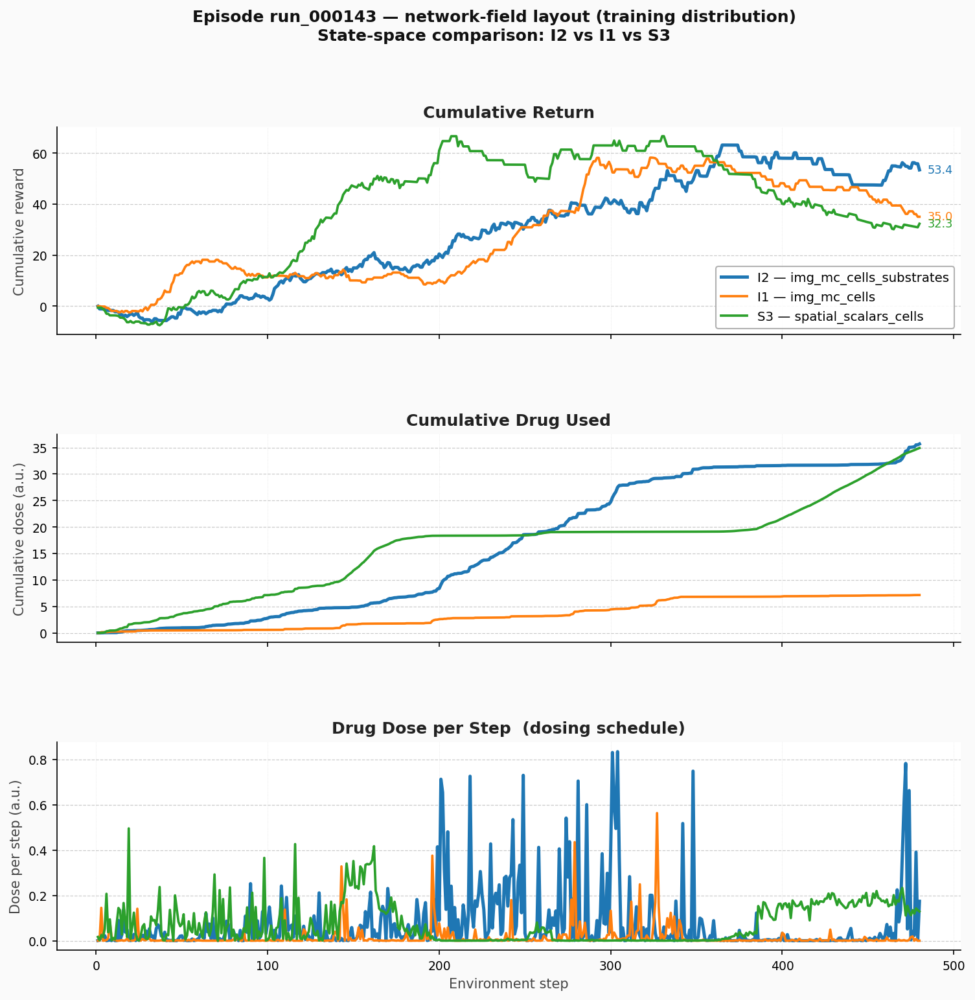

### Episode Videos — run\_000147

> GitHub does not render `<video>` tags — click the links below to download or play the `.mp4` files directly.

| Agent | Video |
|-------|-------|
| **Side-by-side (I2 / I1 / S3)** | [comparison\_I2\_I1\_S3\_run000147.mp4](https://raw.githubusercontent.com/Dante-Berth/PhysiGym/main/model/tumor_immune_tcells_v2/report/videos/comparison_I2_I1_S3_run000147.mp4) |
| I2 — `img_mc_cells_substrates` | [I2\_img\_mc\_cells\_substrates\_run000147.mp4](https://raw.githubusercontent.com/Dante-Berth/PhysiGym/main/model/tumor_immune_tcells_v2/report/videos/I2_img_mc_cells_substrates_run000147.mp4) |
| I1 — `img_mc_cells` | [I1\_img\_mc\_cells\_run000147.mp4](https://raw.githubusercontent.com/Dante-Berth/PhysiGym/main/model/tumor_immune_tcells_v2/report/videos/I1_img_mc_cells_run000147.mp4) |
| S3 — `spatial_scalars_cells` | [S3\_scalars\_cells\_run000147.mp4](https://raw.githubusercontent.com/Dante-Berth/PhysiGym/main/model/tumor_immune_tcells_v2/report/videos/S3_scalars_cells_run000147.mp4) |

*Left panel of the side-by-side: I2 `img_mc_cells_substrates` — Centre: I1 `img_mc_cells` — Right: S3 `spatial_scalars_cells`. All three agents run from the same initial conditions (seed 128, network-field layout).*

### 13.1 Episode Statistics

| Metric | I2 — `img_mc_cells_substrates` | I1 — `img_mc_cells` | S3 — `spatial_scalars_cells` |
|--------|:------------------------------:|:-------------------:|:----------------------------:|
| Final tumor count | 31 | 64 | 43 |
| Cumulative return (final) | **+53.4** | +35.0 | +32.3 |
| Peak cumulative return | **+63.1** (step 365) | +58.2 (step 323) | +66.6 (step 330) |
| Cumulative dose used | **35.69** | 7.16 | 34.92 |
| Peak dose per step | **0.834** | 0.563 | 0.496 |
| Episode length | 480 steps | 480 steps | 480 steps |

### 13.2 Panel-by-Panel Interpretation

**Cumulative Return (top panel)**

All three agents build positive cumulative return through the first ~330 steps, then the slope flattens or turns negative — indicating the tumor rebounds after initial suppression. The three trajectories are remarkably close up to step ~200, then diverge:

- **I2** (+53.4 final) maintains the lead throughout and declines the least after its peak (+63.1 at step 365). Its substrate channels continue to provide feedback that lets the agent partially contain the rebound.
- **S3** peaks highest of the three (+66.6 at step 330) but declines more sharply afterward, ending at +32.3. The spatial cell features are sufficient for early suppression but cannot sustain it once the tumor re-establishes — without substrate spatial information the agent cannot track the evolving immunosuppressive gradient.
- **I1** (+35.0 final) shows the same rollback pattern. Notably its peak (+58.2 at step 323) is close to S3, suggesting both modes achieve similar early suppression but both lose control past the midpoint for different reasons.

Comparing with run\_000143: in that episode I2 achieved +175 by near-eradicating the tumour (final count 4). Here the tumour is not eradicated (final count 31), so the agent accumulates fewer positive rewards in the second half — illustrating that the reward function is **trajectory-sensitive**: near-eradication yields compounding positive rewards, while a stabilised-but-not-eliminated tumour yields near-zero per-step rewards as growth and suppression balance out.

**Cumulative Drug Used (middle panel)**

The drug usage split is starker here than in run\_000143:

- **I2 and S3** both apply ~35 cumulative dose units, nearly identical and much higher than I1.
- **I1** uses only 7.2 units — again under-medicating severely, consistent with the pattern seen in run\_000143. The cell-only image provides no substrate feedback, so the policy has not learned to commit to sustained dosing.

Despite identical cumulative dose between I2 and S3, only I2 achieves a better final outcome (+53.4 vs +32.3), confirming that **where** the drug is placed (guided by substrate maps in I2) matters as much as **how much** is applied.

**Drug Dose per Step — dosing schedule (bottom panel)**

- **I2** shows a burst-heavy schedule concentrated in the second half (steps 300–480), corresponding to an attempted late-episode push against the rebounding tumour. The largest spikes appear after step 350, when cumulative return is already declining — a reactive rather than pre-emptive strategy.
- **S3** applies doses more uniformly across the episode with moderate spikes, reflecting a spatial-centroid-based targeting strategy that lacks the precision of substrate gradient information.
- **I1** produces sparse, low-amplitude pulses throughout with no sustained burst phase — confirming it has learned a fundamentally conservative policy that fails to commit drug resources at the critical moments.

### 13.3 Comparison Between run\_000143 and run\_000147

| | run\_000143 (seed 64) | run\_000147 (seed 128) |
|---|:---:|:---:|
| I2 final tumor | **4** (near-eradication) | 31 (rebound) |
| I2 cumulative return | +175.1 | +53.4 |
| I1 final tumor | 112 | 64 |
| S3 final tumor | 14 | 43 |
| All agents: return rollback? | No | **Yes** |

The contrast between these two episodes reveals that the state space advantage of I2 is most decisive when eradication is achievable — in that regime I2 pushes all the way to the termination threshold while I1 and S3 stall. When the tumour is more resilient (run\_000147), all three agents struggle with the rebound, but I2 still maintains the highest final return. This suggests the substrate spatial information is especially critical for the **final-phase targeting** needed to cross the eradication threshold.

---

## 14. Episode Comparison — run\_000131 (seed 1)

A third matched episode (`run_000131`, seed 1, network-field layout) comparing I1, I2, and S3. This episode is notable because **all three agents run for the full 480 steps** (no early termination), making it a clean head-to-head comparison of sustained tumour control.

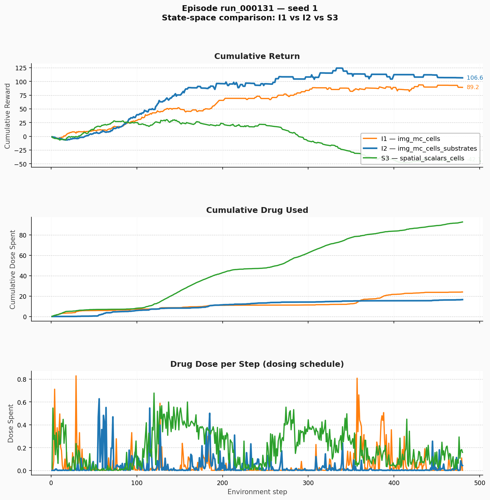

### 14.1 Episode Statistics

| Metric | I2 — `img_mc_cells_substrates` | I1 — `img_mc_cells` | S3 — `spatial_scalars_cells` |
|--------|:------------------------------:|:-------------------:|:----------------------------:|
| Final tumor count | **16** | 20 | 52 |
| Cumulative return | **+106.6** | +89.2 | −42.1 |
| Cumulative dose used | **16.54** | 24.00 | 92.65 |
| Peak dose per step | 0.627 | 0.829 | 0.678 |
| Episode length | 480 steps | 480 steps | 480 steps |

### 14.2 Key Observations

**Cumulative Return (top panel)**

I2 leads throughout (+106.6 final), with I1 close behind (+89.2). Both image modes achieve sustained positive returns. **S3 collapses to −42.1** — the scalar spatial-cells agent fails entirely in this episode, accumulating increasingly negative rewards as the tumour grows despite heavy dosing.

**Cumulative Drug Used (middle panel)**

The most striking result: S3 uses **92.65 cumulative dose units** — over 5× more than I2 (16.54) and nearly 4× more than I1 (24.00) — yet achieves the worst outcome. This is a textbook case of **blind overdosing**: without substrate spatial information the agent cannot tell whether the drug is reaching the macrophages, so it compensates by injecting more. I2 achieves the best tumour control with the least drug, confirming that spatial substrate feedback enables *precision* targeting, not just more aggressive dosing.

**Drug Dose per Step (bottom panel)**

I2 and I1 both show burst-pattern dosing with moderate peak doses. S3 shows nearly continuous high-dose application throughout the entire episode — consistent with a policy that has no spatial feedback signal and defaults to maximum dosing as a heuristic.

### 14.3 Episode Video — run\_000131

| Agent | Video |
|-------|-------|
| **Side-by-side (I1 / I2 / S3)** | [comparison\_I1\_I2\_S3\_run000131.mp4](https://raw.githubusercontent.com/Dante-Berth/PhysiGym/main/model/tumor_immune_tcells_v2/report/videos/comparison_I1_I2_S3_run000131.mp4) |
| I1 — `img_mc_cells` | [TME\_V2\_1\_img\_mc\_cells — run\_000131](https://raw.githubusercontent.com/Dante-Berth/PhysiGym/main/model/tumor_immune_tcells_v2/report/videos/comparison_I1_I2_S3_run000131.mp4) |

### 14.4 Three-Episode Summary

| | run\_000143 (seed 64) | run\_000147 (seed 128) | run\_000131 (seed 1) |
|---|:---:|:---:|:---:|
| I2 final tumor | **4** (near-eradication) | 31 (rebound) | **16** |
| I2 cumulative return | +175.1 | +53.4 | **+106.6** |
| I1 final tumor | 112 | 64 | 20 |
| I1 cumulative return | −7.4 | +35.0 | +89.2 |
| S3 final tumor | 14 | 43 | 52 |
| S3 cumulative return | +106.3 | +32.3 | **−42.1** |
| Dominant failure mode | I1 under-medicates | All agents rebound | S3 overdoses blindly |

Across all three episodes, **I2 consistently achieves the best final tumour count and cumulative return**. The failure modes differ: I1 under-medicates (no substrate feedback → conservative policy), S3 either over-doses blindly (run\_000131) or achieves partial control that cannot sustain (run\_000143/147). I2's substrate channels close both failure modes simultaneously — the agent knows *where* to inject (from substrate maps) and *whether* the injection worked (from feedback in the next observation).

---

## 15. Visual "Chaos" vs. Quantitative Performance — run\_000164 (seed 32)

A recurring observation when watching test-episode videos of `img_mc_cells_substrates` (I2) is that the policy **looks** more erratic than the corresponding `img_mc_cells` (I1) policy — frequent small action changes, jittery injection placement, less visually "decisive" behaviour. Yet the aggregated training/test curves in §6 are unambiguous: I2 wins on both training and test return.

run\_000164 from seed 32 is included as a representative example of this phenomenon. Both videos are from the same matched test episode (same seed, same initial layout, same evaluation step):

### Episode Videos — run\_000164

> GitHub does not render `<video>` tags — click the links below to download or play the `.mp4` files directly.

| Video | Link |
|---|---|
| I2 — `img_mc_cells_substrates` (seed 32) | [I2\_img\_mc\_cells\_substrates\_run000164\_seed32.mp4](https://raw.githubusercontent.com/Dante-Berth/PhysiGym/main/model/tumor_immune_tcells_v2/report/videos/I2_img_mc_cells_substrates_run000164_seed32.mp4) |
| I1 — `img_mc_cells` (seed 32) | [I1\_img\_mc\_cells\_run000164\_seed32.mp4](https://raw.githubusercontent.com/Dante-Berth/PhysiGym/main/model/tumor_immune_tcells_v2/report/videos/I1_img_mc_cells_run000164_seed32.mp4) |

### 15.1 Why I2 Looks Chaotic

Several factors contribute to the visual impression that I2's policy is "noisier" than I1's:

1. **More degrees of freedom in the observation.** I2 sees substrate gradients and the drug-1 concentration field that I1 cannot. The agent can make finer, more localised corrections in response to the diffusing drug plume and pro/anti-tumoral fields. These small corrections show up as frequent, small action changes rather than a single decisive injection — visually "twitchy" but quantitatively beneficial.

2. **Feedback loop on the agent's own injections.** Because the `drug_1` channel is part of the I2 observation, the agent reacts to the consequences of its own past actions. A small dose at step *t* visibly changes the substrate field at step *t+1*, prompting another fine-tuning action. This self-referential dynamic produces high-frequency policy adjustments that look chaotic but reflect closed-loop control rather than open-loop dosing.

3. **Reward composition rewards micro-adjustments.** The reward is `w_cell × tumour_drop − dose_spent`. A policy that places many small, precisely targeted doses along the tumour boundary out-performs a policy that delivers one large central dose — even if the latter looks "cleaner". The dose-cost term `−dose_spent` strongly penalises over-dosing, so optimal play involves careful, repeated micro-corrections.

4. **Single-episode visual judgement is misleading.** Aggregated curves average over many episodes and modes (`circular`, `rectangle`, `network_field`). A chaotic-looking episode in isolation may still be a winning strategy in expectation. The visual coherence of I1 partly reflects the fact that I1 has no choice but to commit to a coarse strategy — it lacks the information to do anything finer.

### 15.2 Take-Away

The "chaos" is the symptom of a policy operating in a richer observation space with closed-loop feedback on its own perturbations. **The curves are the ground truth**, not the videos: cumulative return and final tumour count consistently favour I2 across seeds. The visual impression of erratic behaviour reflects the *information advantage* I2 has over I1, not a deficiency of the policy.

If quantifying this is desired, the right metrics are **action-autocorrelation** and the per-step action delta `‖a_t − a_{t-1}‖`. A chaotic-but-better policy will have lower autocorrelation than I1 but higher cumulative return — making the "trade-off" between visual smoothness and performance explicit.

---

## 16. W&B Training Curves & Observation Visualisations

### 16.1 Observation Mode Visualisation (I2 — `img_mc_cells_substrates`)

The images below show the 8-channel image observation at six time steps of a single episode, illustrating what the best-performing agent actually sees.

| Step 0 | Step 20 | Step 40 |
|--------|---------|---------|
| 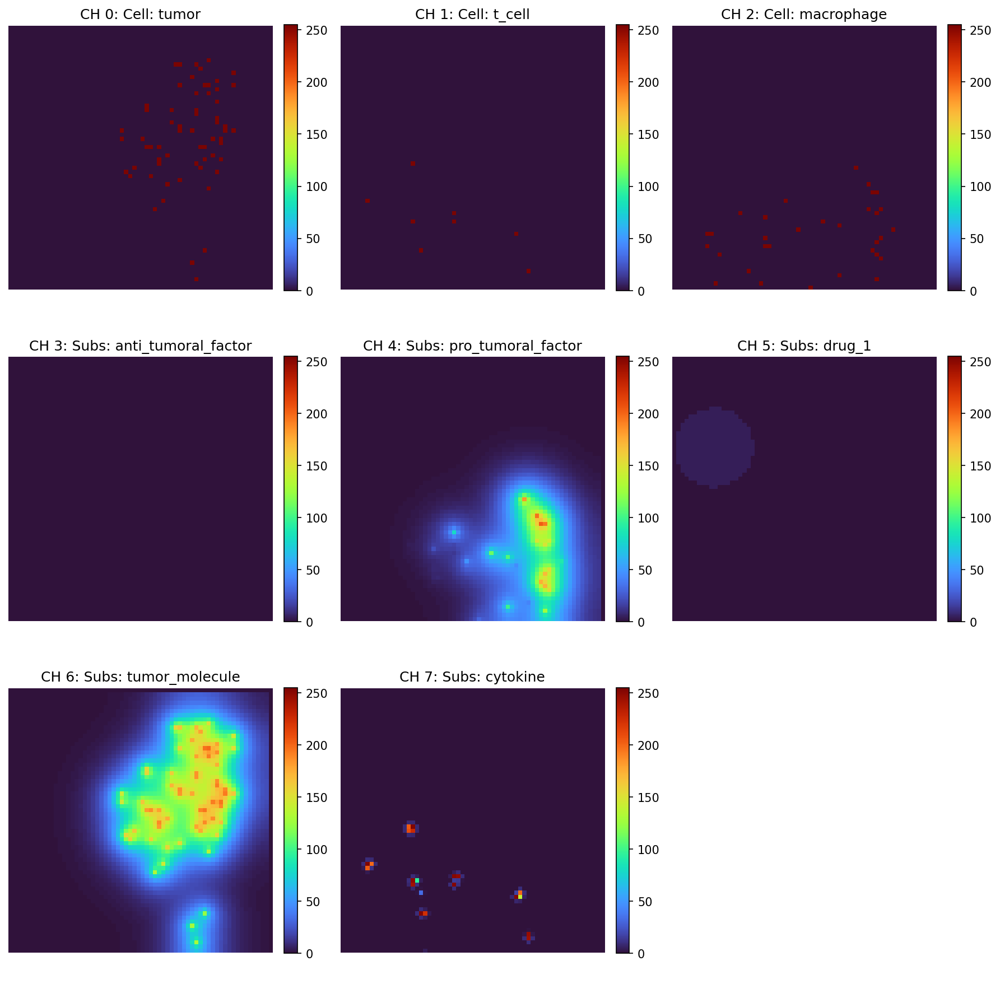 | 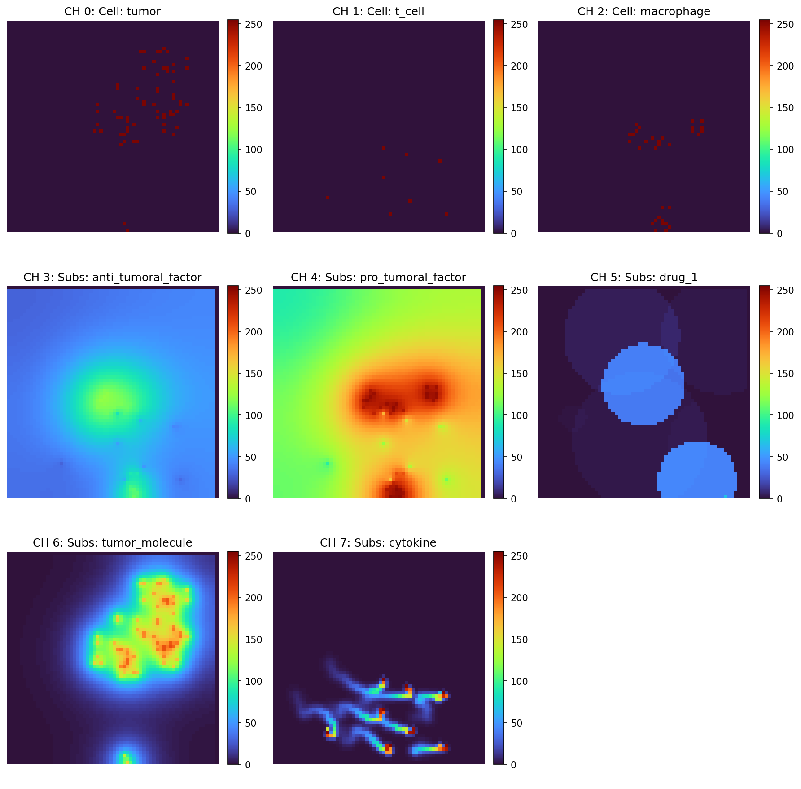 | 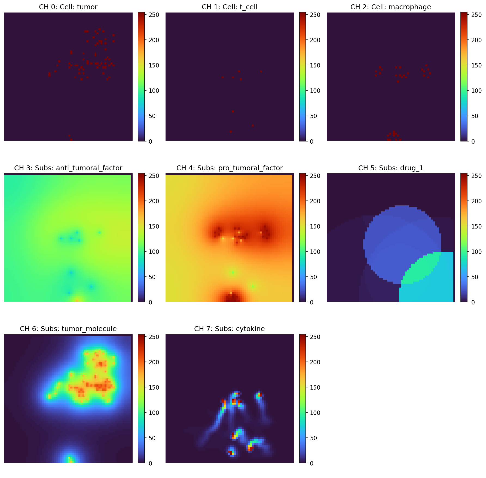 |

| Step 60 | Step 80 | Step 100 |
|---------|---------|----------|
| 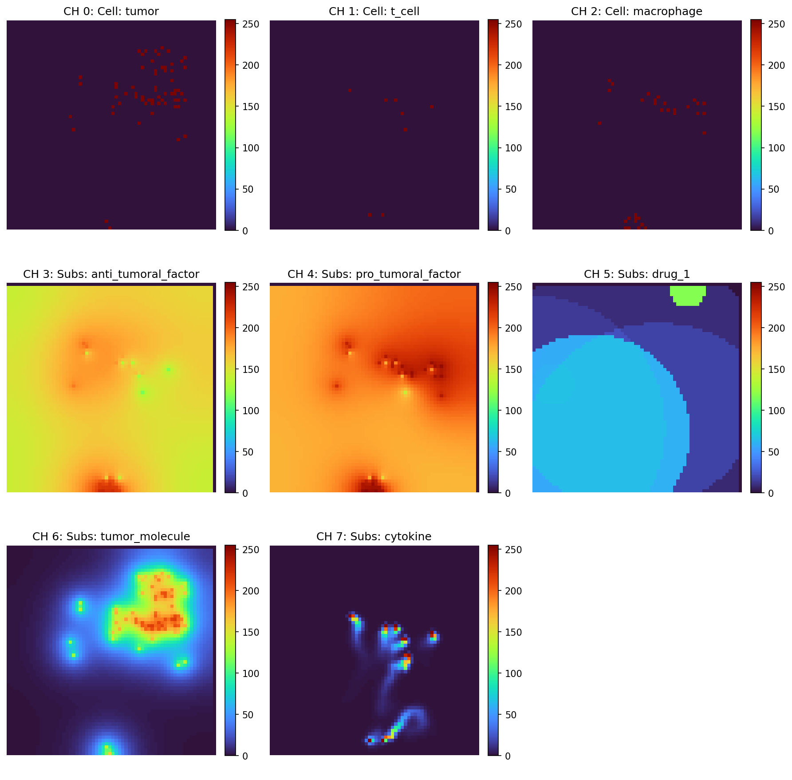 | 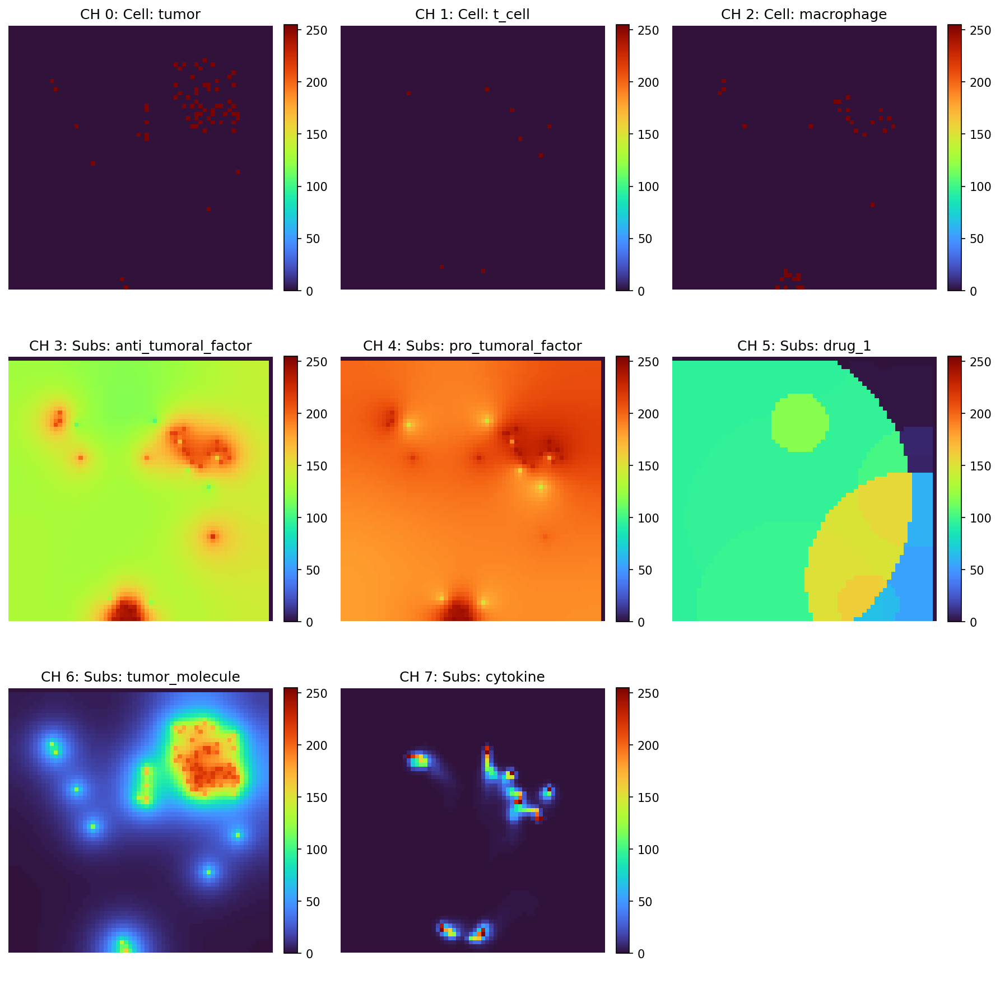 | 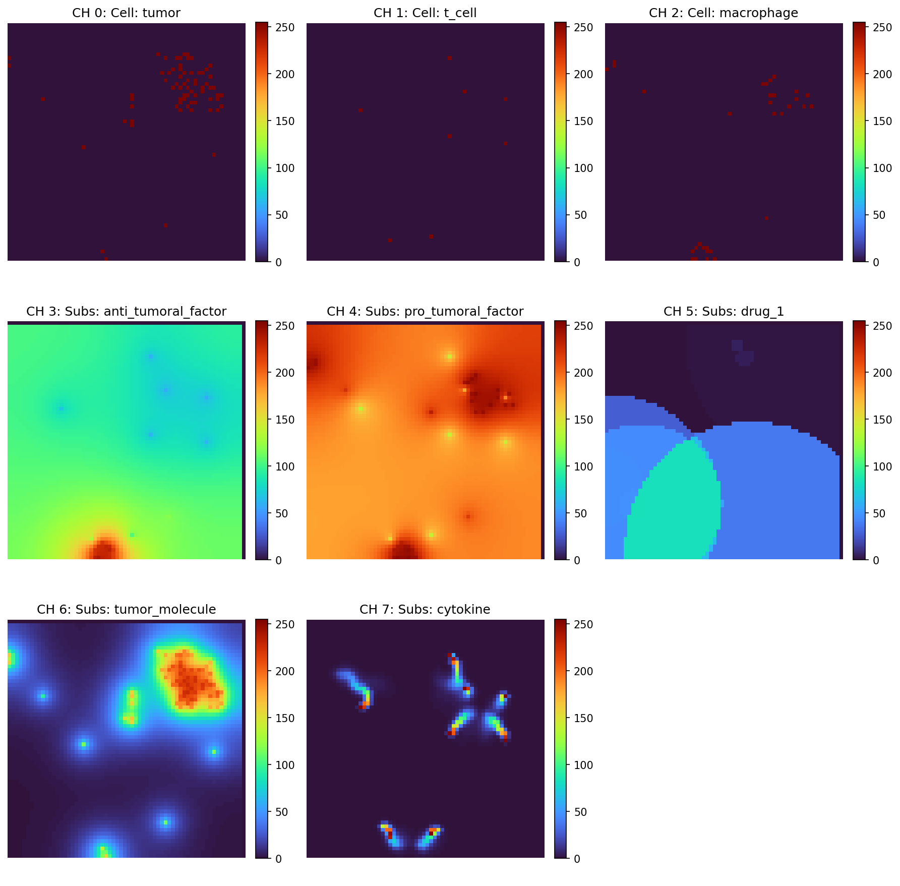 |

Each image has 8 channels (shown as separate panels): **CH 0–2** = tumor, T-cell, macrophage density grids; **CH 3–7** = anti\_tumoral\_factor, pro\_tumoral\_factor, drug\_1, tumor\_molecule, cytokine concentration maps. All 5 substrates are included.

**Key observation per state space:**

| State space | What the agent sees | What is missing |
|-------------|--------------------|--------------------|
| **I2** `img_mc_cells_substrates` (8ch, 64×64) | Full spatial layout of all 3 cell types + all 5 substrate concentration maps (anti\_tumoral, pro\_tumoral, drug\_1, tumor\_molecule, cytokine) | Nothing — full spatial state |
| **I1** `img_mc_cells` (3ch, 64×64) | Spatial layout of tumor, T-cell, macrophage only | All substrate maps — no feedback on drug spread or immune gradients |
| **S3** `spatial_scalars_cells` (21-dim) | Per cell type: presence flag, x\_mean, y\_mean, x\_std, y\_std, dist\_to\_center | All substrate information; spatial resolution limited to centroid/spread summary |
| **S1** `scalars_cells` (3-dim) | Normalised alive count per cell type only | Spatial structure, substrate gradients — minimal signal |

The substrate channels (CH 3–7) are crucial: **CH 4** (`pro_tumoral_factor`) shows where the immunosuppressive gradient is strongest — exactly where the agent must deliver drug to repolarise macrophages. Without this, I1 and S1 agents cannot close the feedback loop between dosing and macrophage repolarisation.

For **S2** (`scalars_cells_substrates`) and **S4/S5** (scalar substrate extensions): adding `max(concentration)` per substrate introduces a single scalar per substrate — this is dominated by the global peak and adds noise rather than spatial signal, explaining why S2 performs worse than S1 and S4/S5 do not outperform S3.

---

### 16.2 Training Curves — All Observation Modes (W&B panels)

The panels below cover **all 7 observation modes** (S1–S5, I1, I2). Legend: **I2** `img_mc_cells_substrates` = red dashed; **I1** `img_mc_cells` = dark green; **S5** `spatial_scalars_cells_spatial_substrates` = green dot; **S3** `spatial_scalars_cells` = blue; **S4** `spatial_scalars_cells_substrates` = red solid; **S2** `scalars_cells_substrates` = cyan; **S1** `scalars_cells` = grey.

**Training return (smoothed, `train_return_mean50`):**

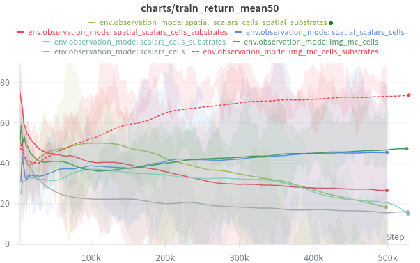

**I2** (red dashed) separates clearly from all other modes after ~50k steps and reaches ~75–80 by 500k steps. **I1** (dark green) converges to ~47, showing that spatial cell images alone provide strong signal but the substrate gap is decisive. All scalar modes (S1–S5) plateau below 35, confirming the image vs. scalar gap reported in §6. Among scalars, **S3** (blue) is most stable; S4/S5 with substrate scalars do not outperform S3 despite higher dimensionality.

**Training return standard deviation (`train_return_std`):**

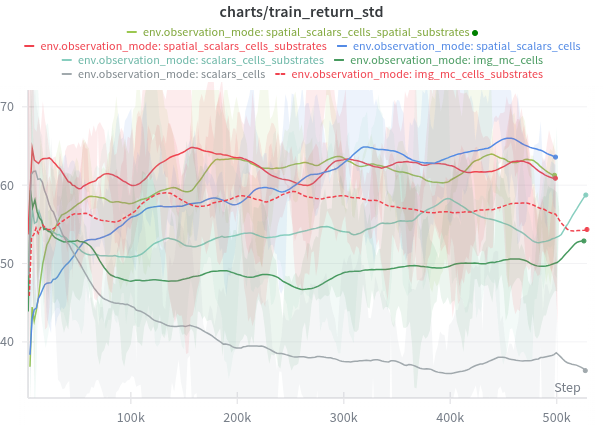

**I2** and **I1** maintain consistently high std (~60–65) throughout training — reflecting the diverse episode outcomes across seeds (some near-eradication, some rebound). Scalar modes show lower and decreasing std, meaning their policies converge to a narrower, less ambitious behavioural range.

**Test return — rectangle layout (raw):**

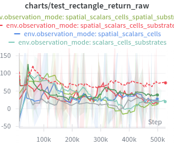

**Test return — circular layout (raw):**

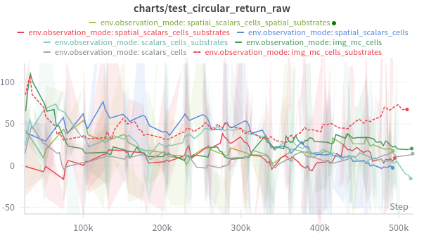

On both held-out test layouts, **I2** (red dashed) leads with the highest and most consistent returns. **I1** (dark green) shows volatile performance — competitive on some seeds, poor on others — highlighting that without substrate information, generalisation to unseen layouts is unreliable. Scalar modes (S1–S5) are clustered near zero or negative on both test layouts, with high run-to-run variance. The circular layout (right) is harder to generalise to: even I2 shows more spread than on rectangle.

**Test return (smoothed, `test_return_mean50`):**

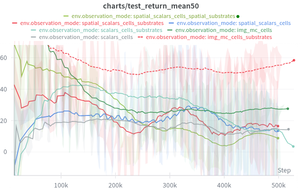

The smoothed view confirms **I2** as the dominant mode on test, steadily climbing to ~55–60 by 500k steps. **I1** trails at ~20–25. Among scalar modes, **S3** is the most stable but peaks around 15. `scalars_cells_substrates` (S2, cyan) degrades after an early peak — the substrate noise problem: max-concentration scalars overfit to training layout geometry and do not transfer.

**Test return standard deviation (`test_return_std`):**

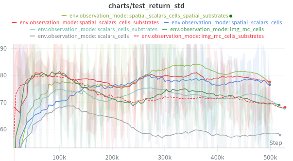

**I2** shows the highest test std across all modes — reflecting that it achieves very high returns on some episodes (near-eradication) and moderate returns on others. This is a sign of a capable but not yet fully robust policy, rather than instability. All scalar modes converge to low test std, consistent with conservative low-dose policies that produce predictable but modest outcomes.

---

## 17. Cross-NN Relational State Space — C1 (`cross_nn_relational`)

### 17.1 Motivation and Core Insight

All previous scalar modes — including the relational mode R1 — describe each biological entity **in isolation or through summary centroids**. R1's Block 2 computes the distance and angle *between centroids*, but the centroid distance is a **coarse aggregate**: two populations whose centroids are close may still have only a handful of cells in physical contact, while two populations with distant centroids may have a diffuse fringe of one infiltrating the other.

The key spatial feature a CNN implicitly computes from a multi-channel image is **local co-presence**: at pixel (i, j), both channel A and channel B are non-zero → these populations are in physical contact at that location. The MLP cannot discover this from centroid features alone.

The `cross_nn_relational` mode (C1) addresses this by adding **cross-type nearest-neighbour distance statistics** to R1. For every ordered pair of cell types (A, B), it computes for each A-cell: "how far is my nearest B-cell neighbour?" — and reports the mean and standard deviation of these per-cell distances across the entire A population.

This is the minimal permutation-invariant statistic that captures **population-level infiltration depth** without requiring a CNN:
- **Mean nearest-neighbour distance** (A→B) ≈ how close, on average, each A-cell is to its nearest B-cell — a direct measure of contact zone width
- **Std of nearest-neighbour distances** (A→B) ≈ how uniform the infiltration is — low std means all A-cells are equally close (uniform infiltration); high std means some A-cells are tightly surrounded by B-cells while others are isolated

### 17.2 Observation Vector Structure

C1 = R1 concatenated with the cross-NN block:

```
R1 block (62 floats):
  Block 1 — per-type absolute features      3 types × 5 = 15
  Block 2 — per-pair relational features    3 pairs × 4 = 12
  Block 3 — per-substrate, tumor-relative   5 subs  × 4 = 20
  Block 4 — cross (cell type × substrate)   3 × 5   × 1 = 15

Cross-NN block (12 floats):
  For each ordered pair (A→B), A ≠ B:       3×2 pairs × 2 = 12
    mean_nn_dist_A_to_B   (normalised by domain diagonal → [0, 1])
    std_nn_dist_A_to_B    (normalised by domain diagonal → [0, 1])

Total: 74 floats
```

The 6 ordered pairs are (tumor→t_cell), (tumor→macrophage), (t_cell→tumor), (t_cell→macrophage), (macrophage→tumor), (macrophage→t_cell). Note that (A→B) and (B→A) are **not symmetric**: the mean nearest-neighbour distance from tumor cells to T-cells is not the same as from T-cells to tumor cells when population sizes differ.

### 17.3 Biological Interpretation of the Cross-NN Block

| Pair (A→B) | Mean | Std | Biological meaning |
|------------|------|-----|--------------------|
| tumor → t_cell | low | low | All tumor cells are uniformly surrounded by T-cells → maximal cytotoxic pressure |
| tumor → t_cell | low | high | Some tumor cells are T-cell-adjacent; others are isolated → incomplete infiltration, potential immune escape zones |
| tumor → t_cell | high | any | T-cells are distant from tumor → cytokine-mediated killing is minimal |
| t_cell → macrophage | low | low | T-cells are co-localised with macrophages → pro-tumoral factor secreted by M2 macrophages is directly suppressing T-cells |
| macrophage → tumor | low | any | Macrophages are adjacent to tumor → polarisation drug will have maximum effect if delivered here |
| t_cell → tumor | low | low | T-cells are engaged with tumor mass → drug should reinforce this configuration by protecting anti-tumoral gradients |

### 17.4 Why This Closes the Gap with I2

The IMPALA CNN applied to I2's 6-channel 64×64 input computes, via its first convolutional layer (8×8 kernel, stride 4), local cross-channel statistics across 8×8-pixel neighbourhoods. At 63 µm domain / 64 pixels ≈ 1 µm/pixel, an 8-pixel kernel covers ~8 µm — roughly one cell diameter. This is functionally equivalent to computing, for each spatial location, whether a tumor cell and a T-cell are within ~8 µm of each other.

The cross-NN block computes the **global distribution** of these proximity events across the entire population, summarised as (mean, std). It cannot recover the spatial map of contact zones (multiple disconnected infiltration fronts, for instance), but it directly encodes the *quantity* and *uniformity* of physical contact between populations — which is the primary determinant of cytokine-mediated tumor killing in this model.

### 17.5 Design Choices and Implementation

| Choice | Rationale |
|--------|-----------|
| KDTree per cell type | `O(N log N)` construction, `O(N log M)` query — negligible vs. PhysiCell step |
| Normalise by domain diagonal | All pairs on same [0, 1] scale; domain-size-invariant |
| Ordered pairs (A→B ≠ B→A) | Population size asymmetry makes these informative separately: 1 tumor cell may have mean-NN-to-T-cell = 5 µm (small tumor, T-cells everywhere) while mean-NN-to-tumor from T-cells = 30 µm (many T-cells far from tumor mass) |
| Absent type → 0.0 | If either population is empty, the pair contributes zero — unambiguous signal to the agent that contact is impossible |
| Low = 0.0 bound on obs space | NN distances are non-negative; declared low=-1.0 in Box (same as R1) but runtime values are in [0, 1] — no clipping needed |

**Computational cost:** With ≤ 512 alive cells and ≤ 6 ordered pairs, total KDTree queries ≤ 512 × 6 = 3,072 lookups. This is well under 1 ms per step, negligible relative to the PhysiCell simulation.

**No new dependencies:** uses only `scipy.spatial.cKDTree`, already imported for R1.

### 17.6 Comparison with All State Spaces

| | S3 (21) | K1 (144) | R1 (62) | **C1 (74)** | I2 (24,576) |
|---|---|---|---|---|---|
| Per-type centroid & spread | ✓ | ✓ (k blobs) | ✓ | ✓ | implicit |
| Pairwise inter-type distance (centroids) | ✗ | ✗ | ✓ | ✓ | implicit |
| **Per-cell nearest-neighbour dist (mean)** | ✗ | ✗ | ✗ | **✓** | implicit |
| **Per-cell nearest-neighbour dist (std)** | ✗ | ✗ | ✗ | **✓** | implicit |
| Substrate at tumor positions | ✗ | partial | ✓ | ✓ | ✓ |
| Substrate gradient direction | ✗ | ✗ | ✓ | ✓ | implicit |
| Multi-modal distributions | ✗ | ✓ | ✗ | ✗ | ✓ |
| Deterministic (no iteration) | ✓ | ✗ | ✓ | ✓ | ✓ |
| CNN required | ✗ | ✗ | ✗ | **✗** | ✓ |
| Interpretable | ✓ | partial | ✓ | **✓** | ✗ |

C1's key addition over R1 is the shift from centroid-level to **cell-level spatial coupling**. R1 Block 2 answers "are the population centroids close?" — C1 answers "are the *cells themselves* close, and how uniformly?". These are orthogonally informative: a population pair can have close centroids but sparse cell-level contact (dispersed populations that overlap at their edges), or distant centroids but tight cell-level contact (two compact clusters with a thin interface).

C1's remaining limitation relative to I2 is the **absence of spatial substrate topology**: C1 inherits R1's gradient-direction features (Block 3), which encode the direction toward the peak concentration zone but not the full substrate field. An agent using C1 still cannot distinguish a uniform drug distribution from a tightly localised hotspot, except through the gradient summary.

### 17.7 Expected Positioning in Results

Based on the design analysis:

- **C1 should outperform R1**: the cross-NN block directly encodes the cytotoxic contact signal that R1 cannot represent. The most critical pair, tumor→t_cell mean-NN distance, is a near-direct proxy for the instantaneous cytokine-mediated killing rate.
- **C1 should outperform all S and K modes**: S-modes lack both relational features and cross-NN statistics; K1 lacks cross-NN features and suffers from iterative instability.
- **C1 should narrow the gap with I2 compared to R1**: by encoding cell-level contact geometry, C1 addresses the primary missing ingredient identified in §7 and §12–13. The remaining gap should come from complex substrate topology.
- **C1 generalisation** should be stronger than R1: nearest-neighbour distances are coordinate-free (they depend only on inter-cell distances, not absolute positions), so they are fully invariant to the spatial layout geometry. This is a stronger invariance than R1's centroid-based features, which encode absolute centroid positions in Block 1.
- **Seed stability** comparable to R1: compact, bounded 74-dim space with deterministic computation.

Results for seeds (1, 64, 128) are pending and will be added to §6 once runs complete.

